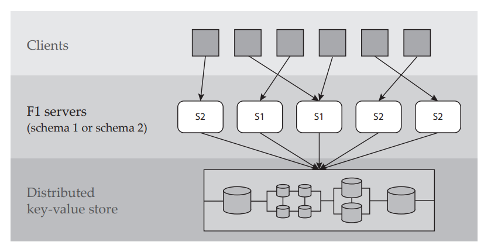

## Schema异步变更
[TinySQL proj3 DDL](https://github.com/pingcap-incubator/tinysql/blob/course/courses/proj3-README-zh_CN.md)中讲到了schema的异步变更，这个project也是要求填完Drop Column相关的代码，通过这个project的测试是非常简单的，但对schema异步变更的理解还差得远。  
TinySQL 中的异步 schema 变更是参照了 Google F1 中的 schema 变更的算法。  
[F1的原始论文](http://static.googleusercontent.com/media/research.google.com/zh-CN//pubs/archive/41376.pdf)  
[中文版论文解读](https://github.com/ngaut/builddatabase/blob/master/f1/schema-change.md)  
这个中文版的解读写的非常好，尤其是类比邮件、qq和微信的例子，真的非常形象，但是读完之后，仍然是一脸懵逼。归根结底是我不太明白schema异步变更的场景，schema是什么？存储在什么地方？为什么要同步？难点在哪儿？最终还是决定去看下论文，论文也并没有从头到尾看完（其实只是看了一小部分QAQ）。

### Schema是什么
An F1 schema is a set of table definitions that enable
F1 to interpret the database located in the key–value store.
Each table definition has a list of columns (along with their
types), a list of secondary indexes, a list of integrity constraints (foreign key or index uniqueness constraints), and
a list of optimistic locks.

### Schema有什么用
All servers in an F1 instance share a set of key–value pairs,
called a database representation, that are located in a
key–value store. To interpret these key–value pairs as rows,
every F1 server maintains a copy of its instance’s schema in
its memory, and it uses this schema to translate relational
operators into the operations supported by the key–value
store. Accordingly, when a client submits an operation, the
schema used for that operation is determined by the schema
currently in the memory of the F1 server the client is connected to.  

### 什么时候开始schema变更
The canonical copy of the schema is stored within the
database representation as a special key–value pair known
to all F1 servers in the instance. When the canonical copy
of the schema is replaced with a new version, it begins a
schema change, which is a process that propagates the
new schema to all servers in an F1 instance. Because F1 is a
highly distributed system with hundreds of servers with no
way to synchronize between them (either explicitly or implicitly), different servers may transition to the new schema at
different times, and multiple schema versions
may be in use simultaneously. Accordingly, we say that a
schema change has completed only when all F1 servers in
the instance have loaded the new schema.

### Schema没有及时变更会出什么问题
Since all F1 servers in an instance share a single key–value
store, improperly executing asynchronous schema changes
can corrupt the database. For example, if a schema change
adds an index to the database, servers still operating on the
old schema will fail to maintain the new index. If this occurs,
any queries which perform index reads will return incorrect
results.